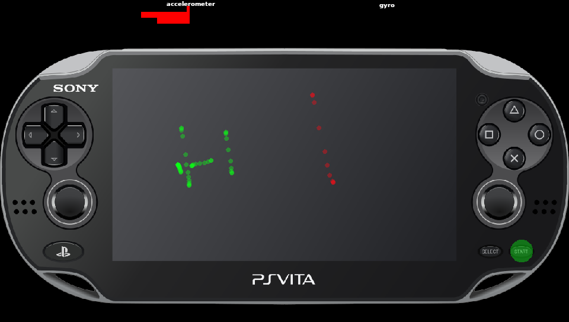

# vitesin

Yeat another vita input tester.

## Features
- Support for multiple controllers
- Support for additional buttons (L2/R2/L3/R3) on external controllers
- Touch testing (front/back)
- Gyro/accelerometer testing
- Rumble testing on external controllers (press L2/R2)
- Led testing on external controllers (with left stick)
